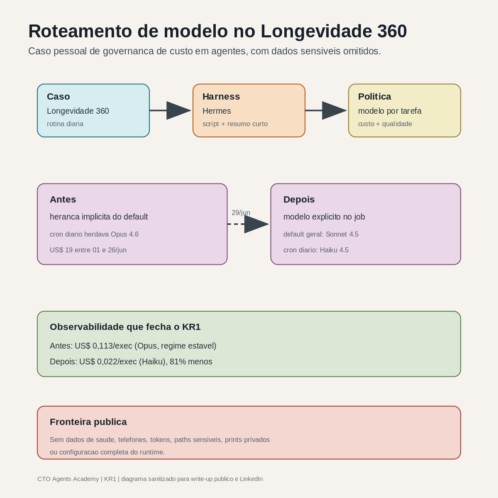

# Roteamento de modelo no Longevidade 360

KR1 da CTO Agents Academy. Write-up técnico público de governança de custo em harness.

Uma rotina diária do Longevidade 360 expôs uma decisão prática de governança de IA: o modelo usado pelo agente precisa combinar com a tarefa.

Entre 01/jun/2026 e 26/jun/2026, a chave da API registrou **US$ 19** de uso porque o Hermes herdava Opus 4.6 como modelo padrão. Boa parte desse valor veio de dias de desenvolvimento e teste do pipeline. O cron em operação, sozinho, custava centavos: o US$ 19 é o total da chave no mês, não o custo da rotina. Em 29/jun/2026, o default do Hermes mudou para Sonnet 4.5 e o cron diário do Longevidade 360 passou a usar Haiku 4.5 de forma explícita.

O checkpoint de custo pós-troca fechou em 04/jul/2026. No regime estável do mesmo job diário, o custo por execução caiu de **US$ 0,113 (Opus) para US$ 0,022 (Haiku), uma redução de 81%**. Base: 5 dias de Opus antes da troca e 4 dias de Haiku depois (01 a 04/jul), com volume de tokens praticamente igual. O dia 30/jun foi a primeira execução em Haiku e saiu cerca de 3x mais pesada, então fica fora da média comparável.

Fonte: export de uso da API por dia e modelo, tabulado numa planilha interna de consumo por dia e modelo. Número verificado por recálculo independente: fórmulas no LibreOffice e cálculo em Python sobre o CSV bruto. Sem print sensível.

## Escopo público

Este write-up usa o Longevidade 360 como caso pessoal de governança de custo em agentes. Os dados de saúde, credenciais, telefones, paths sensíveis, configuração completa do runtime e detalhes de infraestrutura foram omitidos.

O objetivo público é documentar a decisão técnica: quando uma tarefa é pequena, recorrente e bem delimitada, o harness deve escolher um modelo proporcional ao trabalho.

## Caso

O Longevidade 360 coleta sinais de wearables e gera um retrato diário para acompanhamento pessoal. O Hermes entra como camada de harness: ele recebe a saída estruturada de um script, interpreta o estado do dia e envia uma mensagem curta.

O cron diário tinha este perfil:

- entrada estruturada;
- tarefa recorrente;
- resposta curta;
- baixo espaço de decisão;
- necessidade de rastreio de custo.

Esse perfil pede um modelo barato e suficiente para a tarefa. A escolha anterior herdava o modelo default geral do Hermes.

## Antes e depois

| Item | Antes (Opus) | Depois (Haiku) |
|---|---|---|
| Janela comparada (regime estável) | 5 dias em jun | 4 dias, 01 a 04/jul |
| Custo por execução do cron | US$ 0,113 | US$ 0,022 |
| Redução por execução | | 81% |
| Default do Hermes | Opus 4.6 | Sonnet 4.5 |
| Modelo do cron Longevidade | Herdado do default | Haiku 4.5 explícito |
| Primeira execução validada | Antes da troca | 30/jun/2026, 11h15, status ok |
| Evidência técnica | Herança implícita do modelo | Campo `model` explícito no job |

O **US$ 19** citado antes é o total da chave da API no mês (01 a 26/jun), inflado por dias de desenvolvimento. A comparação honesta é por execução, em regime estável: US$ 0,113 contra US$ 0,022.

## Diff sanitizado

O ajuste central no job diário foi a troca de herança implícita por modelo explícito:

```diff
- "model": null
+ "model": "claude-haiku-4-5"
```

O default geral do Hermes também mudou:

```diff
- default_model: claude-opus-4-6
+ default_model: claude-sonnet-4-5
```

Os trechos acima são sanitizados. Eles preservam a decisão técnica e removem dados operacionais.

## Desenho arquitetural



O ponto principal do desenho é separar quatro camadas:

- caso de uso: Longevidade 360;
- harness: Hermes;
- política de modelo: roteamento por tarefa;
- observabilidade: custo, status e revisão.

Essa separação evita que todo agente herde o mesmo modelo por conveniência.

## Decisão técnica

O cron diário do Longevidade 360 passou a usar Haiku 4.5 porque a tarefa tem baixo grau de ambiguidade. O Hermes manteve Sonnet 4.5 como default geral para tarefas mais abertas.

Essa decisão cria uma regra simples:

| Perfil da tarefa | Modelo preferido |
|---|---|
| Rotina curta, recorrente, com entrada estruturada | Haiku |
| Trabalho geral do agente, com raciocínio intermediário | Sonnet |
| Tarefa rara, cara, ambígua ou de alto risco | Modelo mais forte, com justificativa explícita |

## O que muda na governança

O custo deixa de ser uma surpresa de billing e vira parte do contrato do agente.

Cada rotina recorrente precisa declarar:

- qual modelo usa;
- por que aquele modelo cobre a tarefa;
- qual custo esperado;
- qual número dispara revisão;
- qual evidência mostra que a qualidade continuou aceitável.

No caso do Longevidade 360, o número que faltava para fechar a história era o custo pós-troca. Esse checkpoint fechou: US$ 0,022 por execução no Haiku, contra US$ 0,113 no Opus, 81% menos.

## Limites da evidência

Este caso prova governança de custo em um projeto pessoal. Ele não prova produção com terceiro dependente, impacto financeiro corporativo ou maturidade completa de operação agentica.

Para a CTO Agents Academy, o valor do caso está em outro ponto: ele transforma um aprendizado de arquitetura em evidência pública verificável. O KR1 exige exatamente isso: um write-up técnico público, com número e distribuição.

## Ligação com o currículo

Este caso é a evidência viva de [curriculum/01-harness-e-politica-de-modelo.md](../curriculum/01-harness-e-politica-de-modelo.md).
